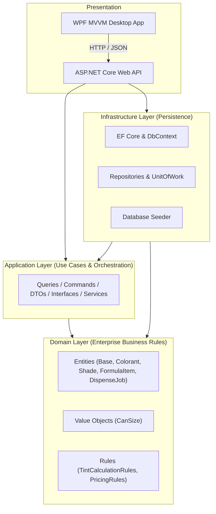
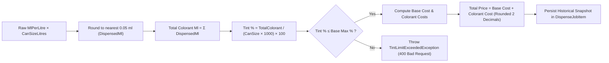
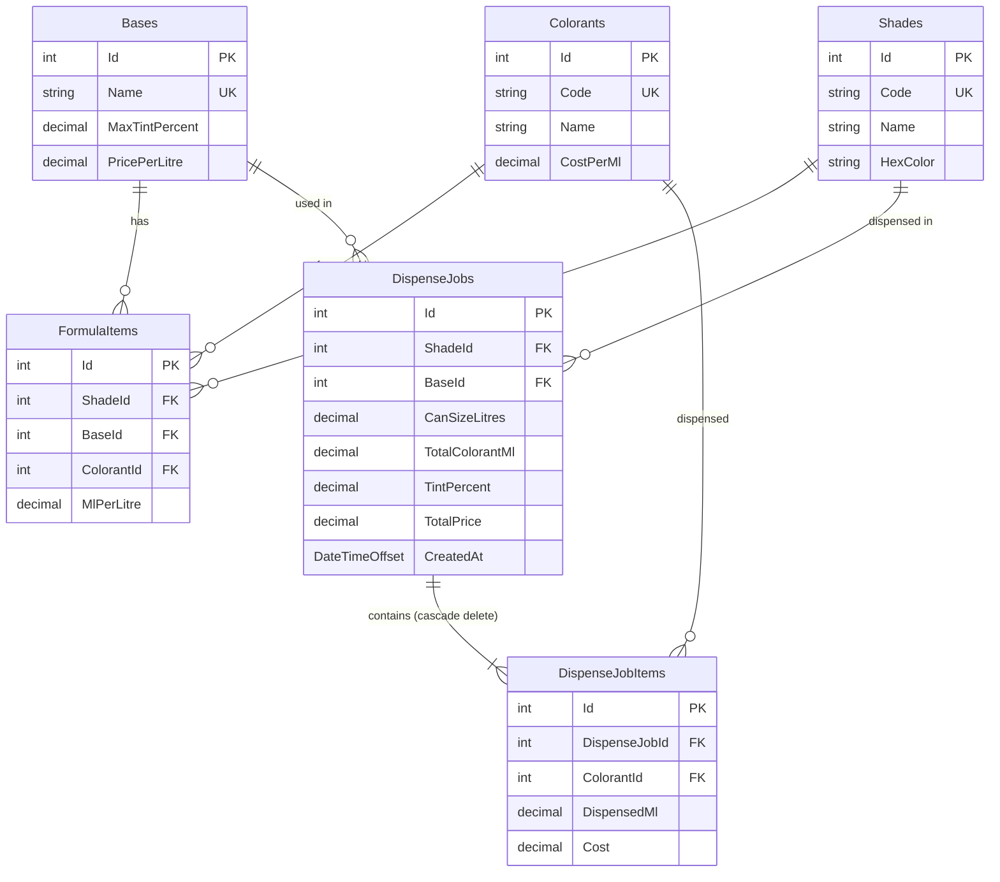

# Paint Tint Formula Calculator — Architecture Specification

## 1. Clean Architecture Overview

The system strictly adheres to **Clean Architecture** and the **Dependency Inversion Principle**. All dependencies point inward toward the Domain model.



### Dependency Rules Enforced
1. **Domain**: Pure C#. Zero dependencies on EF Core, ASP.NET Core, SQL Server, WPF, or external libraries.
2. **Application**: Depends only on Domain. Declares interfaces (`IShadeRepository`, `IBaseRepository`, `IDispenseJobRepository`, `IUnitOfWork`, `ITintCalculationService`) and orchestrates use cases.
3. **Infrastructure**: Implements persistence abstractions defined in Application using EF Core and SQLite/SQL Server.
4. **API**: Composition root registering DI dependencies, exposing thin controllers, and translating domain exceptions into standard HTTP error responses.
5. **WPF**: Autonomous presentation layer using MVVM. Communicates exclusively with the API via asynchronous HTTP JSON calls.

---

## 2. Business Rules & Calculation Flow



### Dispenser Precision & Downstream Calculations
- **Rounding Step**: Raw formula scaled values are rounded to the nearest `0.05 ml` using `Math.Round(amount / 0.05m, MidpointRounding.AwayFromZero) * 0.05m`.
- **Downstream Propagation**: Downstream calculations (total colorant, tint percentage, item cost, and persisted dispense job items) strictly utilize the **rounded dispensed volume**.

### Maximum Tint Percentages by Base
- **Pastel Base**: Maximum allowed tint is `2.00%` (`20 ml/L`).
- **Medium Base**: Maximum allowed tint is `6.00%` (`60 ml/L`).
- **Deep Base**: Maximum allowed tint is `12.00%` (`120 ml/L`).

### Decimal Accuracy
All quantities, monetary costs, percentages, and measurements strictly utilize C# `decimal` (`128-bit` IEEE 754-2008 precision) to eliminate floating-point rounding errors.

---

## 3. Database Schema & Relationships



---

## 4. Live Demo Readiness Guide

During technical evaluation, small on-the-spot changes can be applied cleanly:

### Scenario 1: Change Dispenser Precision (e.g. from 0.05 ml to 0.10 ml)
- **Single Source of Truth**:
  Open [TintCalculationRules.cs](file:///home/parthiban/Desktop/Assignment/src/PaintTintCalculator.Domain/Rules/TintCalculationRules.cs) and modify:
  ```csharp
  public const decimal DispenserPrecisionMl = 0.10m;
  ```
  Both API and tests immediately utilize the updated precision.

### Scenario 2: Add a New Can Size (e.g. 5L or 2.5L)
- **Single Source of Truth**:
  Open [CanSize.cs](file:///home/parthiban/Desktop/Assignment/src/PaintTintCalculator.Domain/ValueObjects/CanSize.cs) and add the size to `SupportedLitres`:
  ```csharp
  public static readonly IReadOnlyList<decimal> SupportedLitres = new[] { 1.0m, 2.5m, 4.0m, 10.0m, 20.0m };
  ```
  Add the corresponding option in WPF [ClientModels.cs](file:///home/parthiban/Desktop/Assignment/src/PaintTintCalculator.Wpf/Models/ClientModels.cs).

### Scenario 3: Update Medium Base Maximum Tint Percentage
- **Persistence / Seeder**:
  Adjust value in [SeedDataService.cs](file:///home/parthiban/Desktop/Assignment/src/PaintTintCalculator.Infrastructure/Seed/SeedDataService.cs) or update the database record. The calculation logic reads `baseEntity.MaxTintPercent` dynamically and enforces limits without requiring any code changes in controllers or ViewModels.

